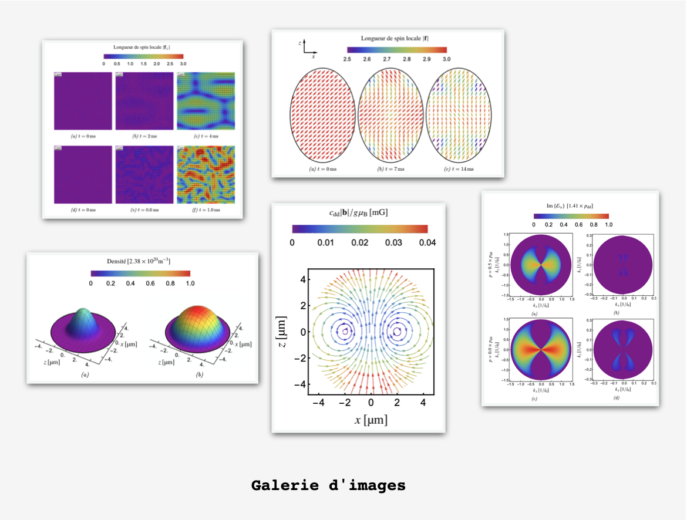

# SDBECLab
 Spin Dipolar BEC Simulation Lab
 
SDBECLab is a toolbox that I developed during my thesis work at the [LPL](http://www-lpl.univ-paris13.fr/LPL_NEWS_WEB/FR/AF.awp) in order to study the behavior of Spinor Bose-Einstein condenses. SDBECLab takes into account scalar systems (without spin) and spin 1, 2 and 3 condenses with, respectively, 3, 5 and 7 degrees of freedom. This tool offers the possibility of carrying out “numerical experiments” by controlling different parameters such as spin-dependent interactions, dipolar relaxation, spatial and temporal variation of the magnetic field, etc. SDBECLab allows both to study the stationary (phase diagram) and dynamic (spin oscillations, demagnetization, etc.) properties of Bose-Einstein condenses. Technically, SDBECLab solves the Spinor Gross-Pitaevskii equation generalized by a dipolar relaxation term which takes into account a process of atomic loss.

 
